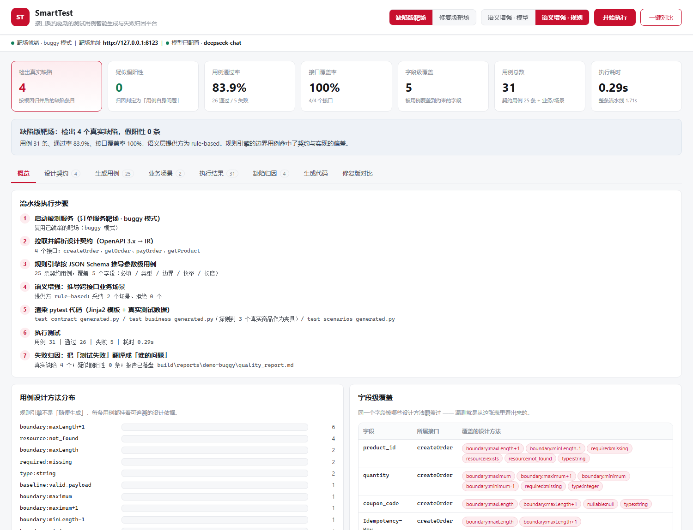
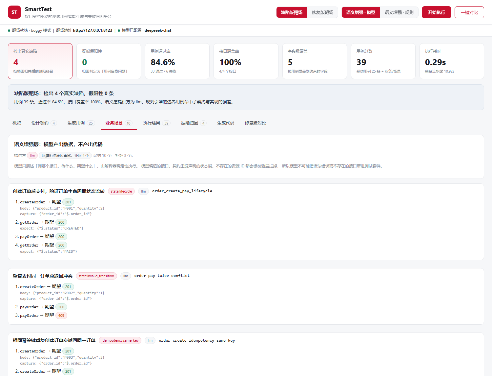
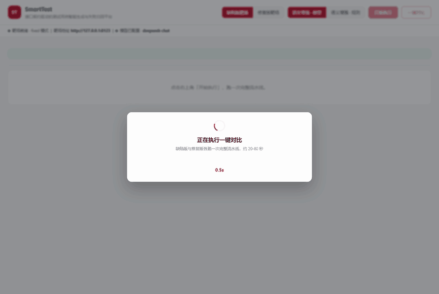

# SmartTest

[](https://github.com/Wangwenbo0523/smarttest/actions/workflows/quality-gate.yml)

**接口契约驱动的测试用例智能生成与失败归因平台**

输入一份 OpenAPI 设计契约，自动产出可执行、可维护的 pytest 测试套件，
执行后自动完成失败归因与质量度量。

---

## 验证结果（可复现）

```
$ python run_demo.py                       # 缺陷版靶场
用例 31 | 通过 26 | 失败 5 | 耗时 0.25s
用例通过率 83.9% | 接口覆盖率 100.0% | 发现缺陷 4 个 | 假阳性 0
  [缺陷 1] 数值范围未校验     (high)  ← quantity.minimum-1 / maximum+1
  [缺陷 2] 字符串长度未校验   (high)  ← Idempotency-Key.maxLength+1
  [缺陷 3] 幂等语义未实现     (high)  ← lifecycle_... / idempotency
  [缺陷 4] 金额精度错误       (high)  ← total_price_precision

$ python run_demo.py --target-mode fixed   # 已修复靶场
用例 31 | 通过 31 | 失败 0 | 耗时 0.24s
发现缺陷 0 个

$ python run_evals.py                      # 用例生成质量评测
召回率 24/24 = 100.0% | 精确率 24/24 = 100.0%

$ python tools/verify_semantic.py          # LLM 通路与幻觉拦截
[PASS] LLM 通路、幻觉拦截、降级机制全部符合预期
```

三个数字构成了完整的自证链：

- **缺陷检出**：报出 4 个缺陷，全部为真实契约违反，**假阳性 0**
- **零误报自证**：把缺陷全部修掉后重跑，缺陷数归零 —— 证明报出来的不是噪声
- **生成质量**：评测集打分 **召回 100% / 精确 100%**

其中**缺陷 2 不是刻意注入的**。它是在评测集指出「header 参数整块没覆盖」、
补上规则之后才暴露出来的 —— 契约写了 `maxLength=64`，实现里没有人去落。
这件事比数字本身更有说服力：**它说明这套方法能发现你原本没意识到的问题。**

---

## 它解决什么问题

接口测试用例的编写高度重复：每个字段都要试必填、类型、长度、边界、枚举。
人工写既慢又漏，而纯靠大模型生成又不可复现、不可度量。

SmartTest 把这件事拆成三层，每层用最适合的方式做：

| 层 | 谁来做 | 做什么 | 为什么 |
|---|---|---|---|
| **契约层** | 规则引擎（确定性代码） | 必填、类型、长度边界、数值边界、枚举、请求头、资源不存在 | 这些能被 JSON Schema 直接推导，必须 100% 覆盖且完全可复现 |
| **场景层** | 语义增强（模型 / 规则推导） | 状态机流转、数据一致性等跨接口场景 | 这些需要业务语义，schema 里没有 |
| **业务层** | 人工模板 | 金额精度、幂等语义等需要领域知识的断言 | 机器推不出来的，就老老实实手写 |

每个用例都带 `design_basis` 标签（如 `boundary:maximum+1=1000`），
所以「覆盖了哪些测试设计方法」是可以统计的，失败时也能反推是哪条规则发现了它。

---

## 快速开始

```bash
pip install -r requirements.txt

python run_demo.py        # 命令行：跑一遍完整流水线并打印质量报告
python run_demo_app.py    # 演示界面：浏览器里跑同一条流水线（默认 http://127.0.0.1:8500）
```

流水线：

```
启动靶场 → 拉取 /openapi.json → 解析为 IR → 规则引擎生成契约用例
        → 语义增强推导跨接口场景 → Jinja2 渲染 pytest
        → 执行 → 失败归因 → 输出质量报告
```

产物：

```
build/generated_tests/test_contract_generated.py   # 25 条契约用例（参数化，可读可 review）
build/generated_tests/test_business_generated.py   # 4 条业务用例（人工模板）
build/generated_tests/test_scenarios_generated.py  # 2 个跨接口场景（数据驱动）
build/generated_tests/scenarios.json               # 场景数据，与代码分离
build/reports/junit.xml                            # 原始执行结果
build/reports/quality_report.md                    # 归因后的质量报告
build/reports/eval_report.md                       # 生成质量评测报告
```

---

## 演示界面

`python run_demo_app.py` 起一个本地 Web 界面。它跑的是**同一条流水线**，
不是另外写的展示层：`demo/pipeline.py` 复用了 `smarttest` 的全部组件，
`tools/verify_demo.py` 把「界面与命令行结果一致」做成了 CI 门禁。



界面把工具内部到底做了什么全部摊开：

| 页签 | 看什么 |
|---|---|
| 概览 | 7 步流水线、用例设计方法分布、字段级覆盖 |
| 设计契约 | 从 OpenAPI 解析出的接口、入参约束、响应字段 |
| 生成用例 | 每条用例的期望码与 `design_basis`，可按设计方法筛选 |
| 业务场景 | 采纳的场景（含每步的捕获与断言）与被拒绝的场景及原因 |
| 执行结果 | junit 结果明细，失败用例可展开堆栈 |
| 缺陷归因 | 归并后的缺陷清单 + 「其余失败」的分类证据 |
| 生成代码 | 渲染出来的 pytest 源码与 `scenarios.json` |
| 修复版对比 | 一键跑 buggy / fixed 两次，直接看零误报自证 |



「一键对比」的实际过程（真实模型通路，播放速度约为实际的 4 倍）：



录屏走的是真实模型通路，用例数是 38 而不是规则推导通路的 31 ——
两条通路生成的场景数不同，但结论一致：缺陷版有缺陷、修复版归零、假阳性都是 0。

界面提供「缺陷版 / 修复版」与「语义增强 · 模型 / 规则」两组切换，
也支持用 URL 参数直达某个状态，便于分享演示链接：

```
http://127.0.0.1:8500/?auto=compare&mode=buggy&llm=0      # 直接跑一键对比
http://127.0.0.1:8500/?auto=1&mode=buggy&llm=1&tab=defects # 真实模型跑完停在缺陷页
```

演示界面刻意没有引入 Streamlit / pandas：用已装栈的 FastAPI + 静态页实现，
`pip install -r requirements.txt` 之后就能跑，不会卡在依赖上。

---

## CI 质量门禁

每次 push / PR 都会跑五道门禁（`.github/workflows/quality-gate.yml`）：

| 门禁 | 命令 | 卡住什么 |
|---|---|---|
| 缺陷检出 | `python run_demo.py --target-mode buggy --expect-defects 4` | 规则引擎漏报或误报 |
| 零误报自证 | `python run_demo.py --target-mode fixed --expect-defects 0` | 修复后仍报出的假阳性 |
| 生成质量 | `python run_evals.py --min-recall 100 --min-precision 100` | 覆盖率或精确率回退 |
| 语义层通路 | `python tools/verify_semantic.py` | 幻觉拦截或降级机制失效 |
| 演示界面 | `python tools/verify_demo.py` | 界面与命令行结果不一致、接口结构缺字段 |

这五道门禁互为补充：**只测「能不能发现问题」会漏掉误报，只测「零误报」会漏掉漏报**。
只有两边都卡住，报告才可信 —— 一个永远抓不到 bug 的工具，和一个永远在报假警的工具，
在团队里的结局是一样的：没人看。

门禁全部走**规则推导通路**（CI 里不配 API Key），保证确定性可复现；
真实模型通路的结果会波动，只用于人工观察，不进回归基线。

门禁本身也做过反向测试：把期望值改错会以非 0 退出，不会「绿」得莫名其妙。
每次运行的质量报告可从 Actions 的 `quality-reports` 构件下载。

---

## 架构

```
         run_demo.py（命令行）      run_demo_app.py（演示界面）
                     │                    │
                     └──── demo/pipeline.py（同一条流水线）────┘
                                  │
   ┌──────────────────────┬───────┴───────────────┐
   ▼                      ▼                       ▼
parser.py             rules.py              semantic/
OpenAPI → IR      JSON Schema → 用例    契约 → 跨接口场景
   │                      │                       │
   └──────────────────────┴───────────────────────┘
                          ▼
                    generator.py （Jinja2 渲染）
                          ▼
                     runner.py  （pytest + junit-xml）
                          ▼
                     triage.py  （失败五分类 + 根因归并）
                          ▼
                     metrics.py （覆盖率 / 缺陷数 / 报告）
```

| 模块 | 职责 |
|---|---|
| `smarttest/ir.py` | 中间模型。屏蔽上游规范差异，换 Postman Collection 只需加 adapter |
| `smarttest/parser.py` | OpenAPI 3.x → IR，含 `$ref` 递归解析，纯确定性实现 |
| `smarttest/dataprovider.py` | 测试数据字典。资源引用类字段取真实数据，不凭空造 |
| `smarttest/rules.py` | **规则引擎**：从 JSON Schema 推导参数级用例（请求体 / 请求头 / 路径参数） |
| `smarttest/semantic/` | **语义增强层**：模型/规则推导跨接口场景 |
| `smarttest/generator.py` | 模板渲染。模板管结构，保证产出可维护 |
| `smarttest/runner.py` | 执行 pytest，解析 junit-xml 为结构化结果 |
| `smarttest/triage.py` | **失败归因**：五分类 + 缺陷模式库 + 根因归并 |
| `smarttest/metrics.py` | 覆盖率与缺陷度量，输出 Markdown 报告 |
| `evals/ground_truth.yaml` | 人工标注的必测清单，评测的基准 |
| `demo/pipeline.py` | 把编排抽成可复用函数，命令行与演示界面共用 |
| `demo/server.py` | 演示服务：FastAPI 接口 + 静态页面，零额外依赖 |

---

## 语义增强层：让模型产出数据，而不是代码

这是整个项目里最值得讲的一块。

**问题**：让 LLM 直接写 pytest 代码，风险有三个 —— 语法可能错、风格会漂移，
最要命的是**它可能编造出契约里根本不存在的接口**。

**做法**：把模型的能力限制在一个封闭的表达空间里。
模型只能描述「调用哪个 operationId、传什么参数、期望什么状态码」，
URL 由解释器从契约里查出来，断言由确定性代码执行。

模型提出的场景必须过三道关卡，每一道都对应一类实测踩过的坑：

| 关卡 | 检查什么 | 拦截什么 |
|---|---|---|
| 结构校验（Pydantic） | 步数 2-8、字段类型、必填项；`rationale` 归一为 `类别:子类`；`capture` 方向纠正 | 结构不合法的输出 |
| **契约交叉核对** | operationId 是否存在、状态码是否在契约声明过、路径参数是否给全、**期望值是否符合契约声明的 `enum`** | **模型幻觉** |
| 骨架去重 | 步骤骨架（接口 + 期望状态码 + 断言/捕获字段）是否与已采纳场景重叠 | 换了 ID 的重复场景 |

被拒的场景会**带着原因记录下来**，而不是静默丢弃 ——
静默丢弃等于把「模型在胡说」这件事藏起来。

实测（`python tools/verify_semantic.py`，假模型服务喂进 6 个场景，不需要 API Key）：

```
[1] LLM 通路：采纳 2 个，拒绝 4 个
    - 拒绝 llm_enum_unknown_value: 第 2 步期望 $.status='SHIPPED' 不在契约声明的枚举 ['CREATED', 'PAID', 'CANCELLED'] 内
    - 拒绝 llm_hallucinated_operation: 第 1 步引用了契约中不存在的 operationId: refundOrder
    - 拒绝 llm_undocumented_status: 第 1 步期望状态码 418 未在契约中声明（createOrder 已声明 [201, 404, 422]）
    - 拒绝 llm_single_step: 结构校验失败 [steps] 场景至少需要 2 步
[2] 模型不可用：提供方=rule-based，采纳 2 个
    降级原因: 无法访问模型接口: timed out
```

同一批里还有一个把期望值写成小写 `created` 的场景，它没有被拒绝 —— 而是被就地归一成
契约声明的 `CREATED` 之后放行。**能安全纠正的就纠正，纠正不了的才拒绝。**

**两条通路，同一套下游**：没配模型时走规则推导（从 HTTP 语义推导「创建→动作→重复动作被拒」
和「创建→查询一致」），配了模型自动升级为语义增强。
下游的校验、渲染、执行完全不用改。

启用模型：

```bash
export SMARTTEST_LLM_API_KEY=sk-xxx
export SMARTTEST_LLM_BASE_URL=https://api.openai.com/v1   # 或任意兼容接口
export SMARTTEST_LLM_MODEL=gpt-4o-mini
python run_demo.py
```

---

## 真实模型实测：提示词不是一次写对的

语义层最初只在假模型服务上验证过。假模型会乖乖返回我想要的 JSON ——
这恰恰掩盖了真实模型的行为。接上 DeepSeek（`deepseek-chat`，`temperature=0`）
跑完整流程后，一共暴露 **9 类问题**，修完才算真正跑通：

| # | 真实模型的表现 | 处理方式 |
|---|---|---|
| 1 | 编造资源 ID（`prod-1001`），靶场里根本没有 | 把 DataProvider 的真实数据作为 `available_test_data` 注入提示词 |
| 2 | 变量占位符写成 `{order_id}` 而不是 `{{order_id}}` | 解释器的正则同时兼容两种写法，不因格式问题崩掉整条链路 |
| 3 | `rationale` 写成中文长句，设计方法标签没法统计 | Pydantic validator 强制归一成 `类别:子类` |
| 4 | 大量输出单步场景（本质是契约层用例，不属于场景层） | 提示词约束 + **回灌拒绝原因重试一次** |
| 5 | JSONPath 写成 `body.order_id`（响应体本身就是 body） | `_dig` 容错去掉多余前缀 |
| 6 | `capture` 键值写反：`{"$.order_id": "order_id"}` | validator 按「JSONPath 必以 `$` 开头」安全纠正方向 |
| 7 | 引用了从未被捕获的变量，导致假阳性 | 解释器前置拦截并打 `[kind=generator]` 标记，归因归类为「用例问题」 |
| 8 | 期望值大小写与契约枚举不符：`$.status == 'paid'`，契约是 `PAID` | **新增枚举对齐关卡**：能安全归一就地归一，对不上则拒绝 |
| 9 | 换个商品 ID 把同一个用例再讲一遍（ID 不同、覆盖重叠） | 按**步骤骨架**去重，重复的连同原因记录 |

第 8 条是最危险的一类：它会被归因当成「状态机流转错误」报出去 ——
**一条指向被测系统的假缺陷**。漏测只是少发现一个问题，假缺陷会让整份报告失去信任。
因为真实模型的输出不可复现，这条用 `tools/verify_semantic.py` 的假模型做成了固定用例回归。

第 4 条的回灌重试单独说：把第一轮被拒场景的**拒绝原因原样喂回去**，让模型知道错在哪，
实测一轮就能把被拒场景基本补回来（某次完整跑测：首轮采纳 5 个、拒绝 6 个，回灌后补回 6 个）。

**真实模型 vs 规则推导**（同一份契约、同一个靶场。下表取某次完整跑测：
真实模型即使 `temperature=0`，每次的场景数也会有 1-2 个波动，所以它不能当回归基线）：

| 通路 | 场景数 | 用例总数 | 缺陷检出 | 假阳性 |
|---|---|---|---|---|
| 规则推导（无模型） | 2 | 31 | 4 | 0 |
| 真实模型（DeepSeek） | 10 | 39 | 4 | 0 |

诚实的结论：**在契约层规则引擎已经决定召回上限的前提下，模型并没有多报出一个缺陷。**
它的增量在场景维度（10 个 vs 2 个），把状态流转、重复动作、往返一致性这些
schema 里推导不出来的用例补了出来；代价是上面这 9 类问题里有 7 类会直接制造假缺陷。

所以「接上大模型」不是终点，**给模型的能力划一个封闭表达空间、再逐条堵住它的出错方式**才是。
这些都不是一次写对的，是靠真实跑测一轮一轮迭代出来的。

---

## 评测：把「生成得对不对」也变成数字

没有评测集的生成器无法迭代 —— 改了规则、换了模型，
只能凭感觉说「好像好一点」。`evals/ground_truth.yaml` 是人工从契约推导的必测清单，
与规则引擎相互独立。

**当前结果：召回率 24/24 = 100%，精确率 24/24 = 100%，无覆盖缺口、无多余生成。**

但这个 100% 是怎么来的，比 100% 本身更有价值：

| 轮次 | 召回率 | 评测指出的缺口 |
|---|---|---|
| 第一轮 | 91.3% | ① 规则引擎整块没处理 **header 参数**<br>② 字符串只生成了上界+1（拒绝侧），漏了**上界本身**（接受侧） |
| 补全覆盖后 | 100% | 无 |

补齐这两类用例之后，**靶场立刻多暴露出一个缺陷**：契约声明 `Idempotency-Key` 的
`maxLength=64`，实现里从来没校验过。这是我写靶场时完全没意识到的一处契约漂移。

> 这就是评测集真正的价值：它不只是让分数好看，而是**把「还有哪没覆盖」变成已知**。
> 覆盖补上去，隐藏的问题就自己浮出来了。

---

## 靶场：4 个真实缺陷

`target_service/` 是一个订单服务，它对外的 `/openapi.json` 就是设计契约本身。
契约描述「应该长什么样」，实现是「实际长什么样」，两者的偏差就是要测的。

| # | 缺陷 | 来源 | 命中用例 |
|---|---|---|---|
| A | `quantity` 未校验 minimum/maximum（契约声明 1-999） | 刻意注入 | `quantity.minimum-1`、`quantity.maximum+1` |
| B | 未实现 `Idempotency-Key` 幂等语义 | 刻意注入 | `lifecycle_createOrder_payOrder`、`idempotency` |
| C | 金额用 float 相乘，未精确到分（`0.10 × 3 = 0.30000000000000004`） | 刻意注入 | `total_price_precision` |
| D | `Idempotency-Key` 未校验 `maxLength` | **补全覆盖后意外发现** | `Idempotency-Key.maxLength+1` |

其余行为全部与契约一致 —— 这样演示才有意义：报出来的是真缺陷，而不是一堆误报。
`SMARTTEST_TARGET_MODE=fixed` 会启用修复版本，用于验证零误报。

---

## 失败归因：为什么这一步决定了工具能不能用

测试失败 ≠ 发现缺陷。环境挂了、数据没了、用例自己写错了，在 pytest 眼里都是 failed。
不把这几类拆开，报告就没人敢信。SmartTest 分成五类：

| 分类 | 判定依据 |
|---|---|
| **真实缺陷** | 期望被拦截（4xx）却放行，或期望成功（2xx）却失败，或 5xx |
| **契约变更** | 期望与实际都是错误码，但码值不一致（如期望 404 得到 400） |
| **环境问题** | 连接失败、超时、依赖不可用 |
| **数据问题** | 前置数据不存在、唯一键冲突 |
| **用例问题** | 生成器自身的假阳性 —— 这个数字越低越好 |

归因后还会**按根因归并**：同一字段的 `minimum-1` 和 `maximum+1` 属于同一个缺陷，
不归并的话一个 bug 会刷出多行，报告可信度直接崩塌。
归并后的条目按粗粒度根因统一措辞（「数值范围未校验」而不是「下界未校验」），
避免标题与合并后的内容对不上。

---

## 面试怎么讲

**Q：为什么用规则引擎，而不是直接让大模型生成用例？**

> 三个原因。第一，不可复现 —— 同样输入两次结果不同，测试用例最忌讳这个。
> 第二，系统性漏边界 —— 模型倾向于生成正常流，恰好漏掉最该测的边界。
> 第三，不可度量 —— 我说不清「哪些用例是必然应该存在的」。
> 所以我把能被 schema 推导的部分用确定性代码做，保证 100% 覆盖；
> 需要业务语义的部分才交给模型。模型只做加法、不做减法，
> 这样生成质量的下限是可控的。

**Q：你怎么防止模型瞎编接口？**

> 我没有让模型生成代码，而是让它生成**数据** —— 它只能填 operationId、参数和期望状态码，
> URL 由解释器从契约里查。而且每个场景进套件前要过两道关：
> Pydantic 校验结构，然后我会拿 operationId 和状态码去契约里逐个核对，
> 对不上就拒掉并记录原因。测试里可以看到，编造的 `refundOrder` 和 418 都被拦下了。
> 之所以不是静默丢弃而是记录原因，是因为静默丢弃等于把「模型在胡说」藏起来。

**Q：边界值怎么自动推导？**

> 从 JSON Schema 的 `minimum`/`maximum`/`minLength`/`maxLength`/`enum` 递归遍历，
> 对每个字段生成 min-1、min、max、max+1 四组取值。
> 但要注意区分「拒绝侧」和「接受侧」：min-1 这类必然期望 4xx，断言无歧义；
> 而 min 这类合法值，只有当字段不引用外部资源时才断言成功 ——
> 像 `product_id` 这种，格式合法不代表资源存在，所以它的取值来自数据字典而不是凭空构造。
> 这一步没做好，就会把「数据不存在」误判成「服务有 bug」。

**Q：你怎么知道生成的用例是对的？**

> 三个维度。一是靶场缺陷检出率：报出 4 个缺陷，全部为真实契约违反，假阳性 0。
> 二是零误报自证：修掉缺陷后重跑，缺陷数归零。
> 三是评测集：人工标注一份必测清单，算召回率和精确率，目前都是 100%。
> 归因里还把「用例问题」单独拆成一类，这个数越低越好。

**Q：为什么还要做一个演示界面？**

> 因为测试工具最大的落地障碍不是能力，是信任 —— 开发不信任你报的缺陷，
> 你就得把「这条缺陷是哪条规则、依据契约的哪一句、命中哪条用例」摊开来给他看，
> 光给一份 Markdown 报告不够直观。
> 界面上我把生成用例、被拒绝的场景、归因证据全部开放出来，
> 并且做了一键对比：同一套用例打在缺陷版和修复版靶场上，
> 缺陷数从 4 降到 0 —— 这个画面比任何解释都有说服力。
>
> 实现上有一点是我特意坚持的：界面必须复用 `run_demo.py` 的同一条流水线。
> 演示层另写一套逻辑，演示就成了表演，证明不了工具本身可用。
> 所以我把编排抽成 `demo/pipeline.py` 供两边共用，
> 又写了 `tools/verify_demo.py` 把「界面与命令行结论一致」做成了 CI 门禁。
> 界面本身用 FastAPI + 静态页，没引 Streamlit，避免演示先卡在装依赖上。

**Q：这个项目最有价值的一次发现是什么？**

> 是我们用评测集把自己的覆盖缺口找出来的那次。第一轮评测显示召回率 91.3%，
> 点出两个问题：规则引擎整块没处理 header 参数，以及字符串只测了「上界+1 被拒绝」，
> 没测「上界本身能通过」。
> 补上之后，靶场**立刻多报出一个缺陷** —— 契约声明 Idempotency-Key 的 maxLength 是 64，
> 实现里从来没校验过，这是我写靶场时完全没意识到的。
> 所以对我来说，评测集的价值不是让分数好看，而是把「还有哪没覆盖」变成已知；
> 覆盖补上去，隐藏的问题会自己浮出来。

**Q：接了真实大模型之后，有没有翻车？**

> 翻得挺厉害。假模型服务上一切正常，换成真实模型第一次跑完整流程就报了 9 类问题：
> 编造资源 ID、变量占位符语法不统一、期望状态写成小写 paid、大量输出单步场景、
> 换个商品 ID 把同一个用例再讲一遍……
> 其中最危险的是「期望值和契约声明的枚举不符」—— 它会被归因当成真实缺陷报出去，
> 是一条指向被测系统的假缺陷。漏测只是少发现一个问题，假缺陷会让整份报告失去信任。
> 我的处理原则分两类：能安全纠正的就地纠正（大小写、capture 方向、JSONPath 前缀），
> 纠正不了的就带着原因拒绝，并把拒绝原因回灌给模型重试一次。
> 这几类问题都不是提示词一次写对的，是拿真实模型跑了才暴露、再逐个堵上的。

**Q：这个项目最难的点？**

> 保证生成质量的下限。生成一堆用例不难，难的是每条都能执行、断言都不含糊、
> 失败时能说清是谁的问题。所以我在架构上把确定性部分和语义部分分开，
> 强制每个用例携带 design_basis 标签，并且在模型和测试套件之间加了一道契约核对。
> 另外，规则推导在推导「重复执行应返回什么」时，我一开始取的是最小 4xx（404），
> 结果误报了一个缺陷 —— 资源刚创建成功，404 在这里没有意义，应该按语义优先级找 409。
> 这种地方就是靠「修复版归零」这个自证机制抓出来的。

---

## 已知边界（诚实清单）

- **只支持 OpenAPI 3.x**。IR 层已预留扩展位，Postman Collection 只需加 adapter。
- **测试数据字典是静态的**（`datasets/testdata.json`）。生产化需要接入数据工厂或按需造数。
- **场景断言能力有限**：只支持状态码和简单字段等值断言，不支持集合、排序、耗时类断言。
- **规则引擎不做多字段组合**：单字段变更保证可控，组合场景交给场景层。
- **CI 门禁已落地为 `.github/workflows/quality-gate.yml`**（4 道门禁，见上文），
  但 Allure 报告未接入，当前用 junit-xml + Markdown。
- **LLM 通路已用真实模型（DeepSeek）跑通完整流程**，缺陷版报 4 个 / 修复版报 0 个、假阳性 0；
  `tools/verify_semantic.py` 保留假模型服务，因为回归需要确定性输入 ——
  真实模型即使 `temperature=0` 也不能当成可复现的测试基线。
- **模型提升的是场景数量，不是缺陷数量**。契约层的规则引擎已经决定召回上限，
  模型没有多报出一个缺陷（都是 4 个）；它的价值在语义场景维度（10 vs 2）。
- **真实模型的缺陷数不是恒定的**：9 次真实模型跑测里有 8 次报 4 个缺陷、1 次报 5 个，
  多出的那条来自模型生成的场景，规则推导覆盖不到同一处行为。两次的假阳性都是 0。
  这也是门禁坚持走规则推导通路的原因 —— 演示界面里看到的模型结果只用于观察。
- **演示界面用 FastAPI + 静态页**，没有引入 Streamlit：演示要能一键跑起来，
  不该先卡在依赖安装上。代价是图表得手写 CSS，没有现成的交互组件。

---

## 下一步

1. ~~用真实模型跑一轮语义增强，对比规则推导的场景质量~~ 已完成（见「真实模型实测」）
2. 把质量门禁推上 GitHub Actions，PR 触发回归 + 评测跑分
3. ~~Demo 界面~~ 已完成（`python run_demo_app.py`，见「演示界面」）；剩余 Allure 报告
4. 测试数据按需造数，替换静态字典
5. 场景层补上枚举/错误码之外的断言能力（集合、排序、耗时）
