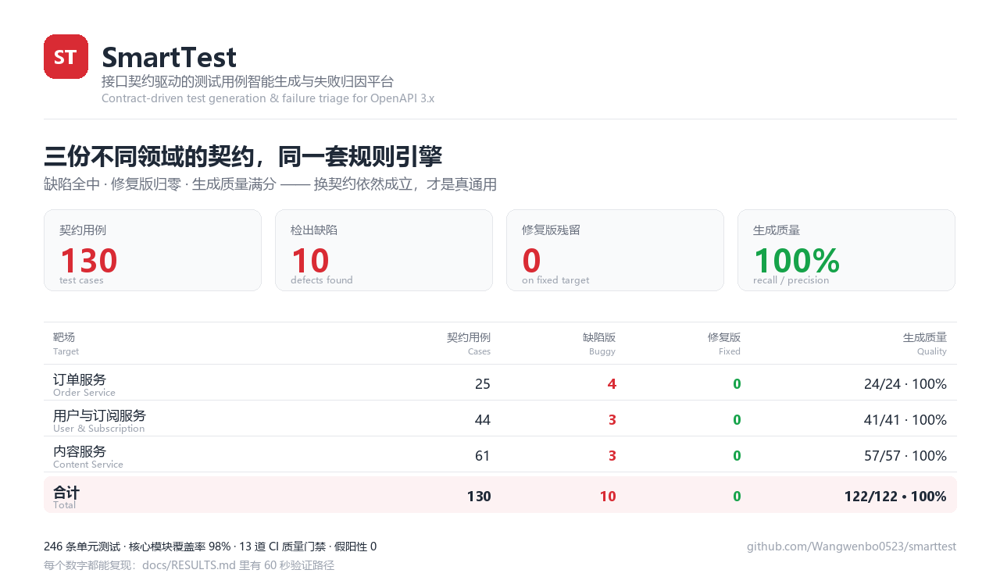

# SmartTest v1.0.0

中文在前，英文在后。/ Chinese first, English below.



---

## 中文

### 它是什么

输入一份 OpenAPI 3.x 设计契约，自动生成可执行、可维护的 pytest 测试套件，
执行后自动完成失败归因与质量度量。**契约描述「应该长什么样」，实现是「实际长什么样」，
两者的偏差就是要被测出来的东西。**

### 结果

三份不同领域的契约，同一套规则引擎、同一条流水线，只换契约、数据字典与业务模板：

| 靶场 | 契约用例 | 缺陷版 | 修复版 | 生成质量 |
|---|---|---|---|---|
| 订单服务 | 25 条 | 4 个缺陷 | 0 个 | 召回 24/24 = 100% |
| 用户与订阅服务 | 44 条 | 3 个缺陷 | 0 个 | 召回 41/41 = 100% |
| 内容服务 | 61 条 | 3 个缺陷 | 0 个 | 召回 57/57 = 100% |
| **合计** | **130 条** | **10 个缺陷** | **0 个** | **122/122 = 100%** |

「缺陷版报得出来、修复版一个都不报」这一对结果才是关键：只证明「能发现问题」不够，
还得证明**报出来的不是噪声**。

### 工程质量

- **246 条单元测试**，核心模块覆盖率 **98%**
- **13 道 CI 质量门禁**：单测、覆盖率、三个靶场各自的缺陷检出 / 零误报 / 生成质量、语义层、演示层
- **可安装、有命令行入口**：`pip install -e .` 之后用 `smarttest run --target users` 一条命令跑通
- CI 跑 Python 3.11（支持的下限），本地开发用 3.13

### 换靶场逼出来的两个真实缺口

这两个都不是「写代码时不小心」，而是**不换被测对象就永远照不出来**的假设：

1. **必填请求头没带上**（用户服务暴露）。契约声明必填头之后，生成的用例只带「被测字段」，
   服务先把请求拦成 422，用例根本没执行到要测的分支 —— 修复版靶场因此误报 7 个假缺陷。
2. **查询参数整块不覆盖**（内容服务暴露）。`location: query` 的参数既不生成用例，
   生成的请求也不带它们。临时关掉这块生成后，评测召回率从 100% 掉到 63.2%、
   接口覆盖率掉到 66.7%，缺陷版从 3 个变成 1 个。

### 快速验证

```bash
git clone https://github.com/Wangwenbo0523/smarttest && cd smarttest
pip install -r requirements.txt

pytest -q --cov=smarttest                                   # 246 条单测，覆盖率 98%
python run_demo.py --target-mode buggy --expect-defects 4    # 缺陷版：报 4 个
python run_demo.py --target-mode fixed --expect-defects 0    # 修复版：报 0 个
python run_evals.py --min-recall 100 --min-precision 100     # 生成质量：100/100

python run_demo.py --target users    --port 8124 --target-mode buggy --expect-defects 3
python run_demo.py --target articles --port 8125 --target-mode buggy --expect-defects 3
```

### 已知边界

- 只支持 OpenAPI 3.x；Postman Collection 需要另加 adapter。
- 规则引擎不做多字段组合，查询参数也只覆盖单参数，不理解参数间互斥。
- 数组只覆盖「类型不对」，不生成元素个数与元素级边界；嵌套只下钻一层对象。
- 业务层断言按靶场手写（金额精度、幂等、去重、默认值这类领域规则推不出来）。
- 覆盖率口径不含编排层与 Jinja2 模板（它们由端到端门禁覆盖）。

细节见 [RESULTS.md](RESULTS.md)。

---

## English

### What it is

Point SmartTest at an OpenAPI 3.x design contract and it produces an executable,
reviewable pytest suite, runs it, and triages every failure automatically.
**The contract says what the API should do; the implementation says what it does;
the gap between them is the product.**

### Results

Three contracts from three different domains — same rule engine, same pipeline,
only the contract, the test-data dictionary and the business template change:

| Target | Contract cases | Buggy build | Fixed build | Generation quality |
|---|---|---|---|---|
| Order service | 25 | 4 defects | 0 | recall 24/24 = 100% |
| User & subscription service | 44 | 3 defects | 0 | recall 41/41 = 100% |
| Content service | 61 | 3 defects | 0 | recall 57/57 = 100% |
| **Total** | **130** | **10 defects** | **0** | **122/122 = 100%** |

The pair of numbers is what matters: finding defects is not enough,
the tool also has to prove that **what it reports is not noise** — which is why
every target ships a buggy build and a fixed build.

### Engineering quality

- **246 unit tests**, **98%** statement coverage on the core modules
- **13 CI quality gates**: unit tests, coverage, per-target defect detection /
  zero-false-positive proof / generation quality, semantic layer, demo layer
- **Installable with a CLI**: `pip install -e .` then `smarttest run --target users`
- CI runs Python 3.11 (the supported floor); local development uses 3.13

### Two real gaps surfaced by switching targets

Neither was a coding slip — both were assumptions that **stay invisible until you
change what is being tested**:

1. **Required headers were not sent.** Once a contract declared a required header,
   generated cases still carried only the field under test, so the service answered
   422 first and the case never reached the behaviour it was meant to check —
   producing **7 false defects** on the fixed target.
2. **Query parameters had no coverage at all.** Parameters with `location: query`
   produced neither cases nor request parameters. Turning that generation off
   dropped the eval recall from 100% to **63.2%** and API coverage to **66.7%**
   (the list endpoint was simply uncovered), while the buggy target reported
   1 defect instead of 3.

### Quick verification

Same commands as above — every number in this document is reproducible in under a minute.

### Known boundaries

- OpenAPI 3.x only; a Postman Collection adapter is not included.
- No multi-field combinations; query parameters are covered one at a time.
- Arrays only get a type check (no item-count or per-item boundaries);
  nested objects are expanded one level deep.
- Business assertions are hand-written per target.
- Coverage excludes the orchestration layer and Jinja2 templates,
  which are exercised by the end-to-end gates instead.

See [RESULTS.md](RESULTS.md) for details.
